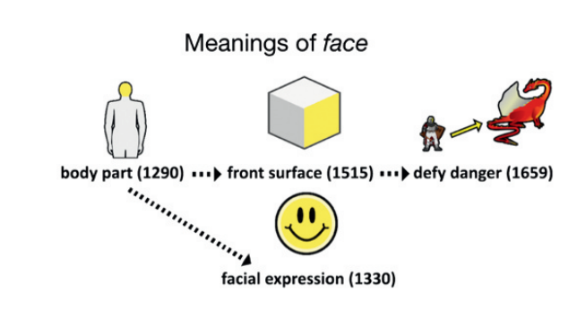
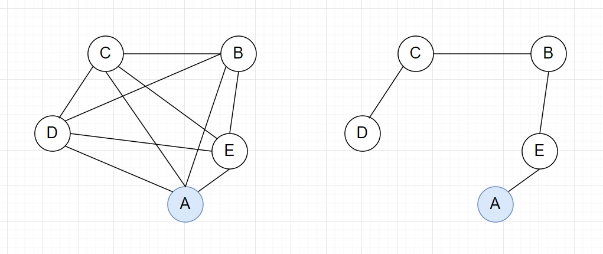

# Algorithms in the historical emergence of word senses

#### 搜索途径

《外语教学与研究》基于大数据的语义实证研究新进展，词义扩展，引用检索

#### 本文来源

PNAS《美国科学院院报》。作者Christian Ramiro，是UC Berkeley的一名大二学生。

#### 研究对象

**How do words develop new senses?**

#### 研究方法

作者以*Historical Thesaurus of English*（HTE，英语历史叙词表）为数据集，研究了过去1000年，即从公元1000年到公元2000年的词义变化情况。

作者首先验证了新词义的诞生途径：

+ exact reused

  直接在原型上扩展（例：face）

+ derived

  加后缀扩展（例：faceless）

+ new form

  创造新词素或前缀进行扩展（例：preface）

通过统计方法得出exact reused是历史上词义扩展的主要形式。

接着，通过词义分类树，用启发式方法定义了两个词义之间的相似度计算公式。

#### 提出的假说

+   Random Algorithm（Null）

    新词义的出现是随机的

+   Exemplar Algorithm

    新词义的出现和已有词义的平均值相关

+   Prototype Algorithm

    新词义的出现和已有词义中最具代表性的词义（即Prototype）相关，最具代表性的词义与其他所有词义的平均距离最小。

+   Progenitor Algorithm

    Prototype Algorithm的静态版本，它认为新词义的出现总是与最早的词义相关。

+   Local Algorithm

    新词义的出现和已有词义中最后出现的相关。

+   Nearest-Neighbor Chaining Algorithm（Proposed Algorithm）

    新词义的出现遵循最小生成树的Prim求解法则，即总是朝着使词义网认知成本最低的方向发展。

提出新词义的出现使得整体认知成本最低，以及用“近邻链”算法来解释词义扩展。通过和已有算法的比对，说明“近邻链”算法能最好地解释历史数据。

[对数似然比检验](https://en.wikipedia.org/wiki/Likelihood-ratio_test)，指出随机算法和其他算法差别显著，表明新词义的出现不是随机的。

$LR=ln(\frac{A}{B})$

t检验，说明“近邻链”算法和其他算法的对数似然比存在显著差异。

#### 结论

历史上新词义的出现是可预测的，并且用整体认知成本最低来解释是最好的。

#### 更多讨论

**模型概率和认知成本之间的关系。**

概率被定义为预测路径每一步的连乘积（独立假设），作者说明认知成本最低的路径不一定是概率最大的。

**可解释性研究**

作者分析了“邻近链”模型解释较好的词和其他模型解释较好的词，前者对词义数多的词解释较好。

#### 未来展望

What factors explain whether a new sense will be expressed by reusing an existing word vs. creating a new word form?

